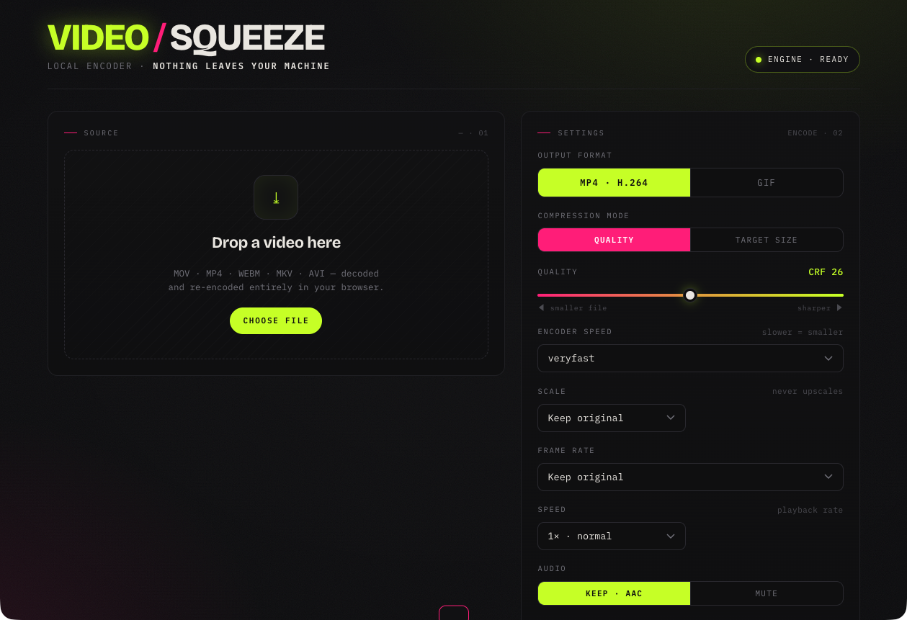
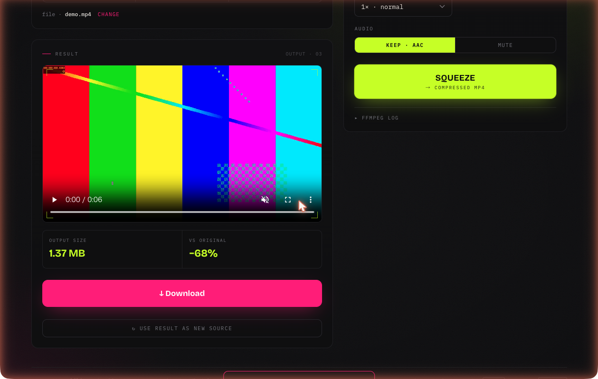

# VIDEOSQUEEZE

**ブラウザだけで動く、完全オフラインの動画圧縮・変換ツール。**
**A fully-offline video compressor / converter that runs entirely in your browser.**

動画を **MP4 (H.264)** か **GIF** に圧縮・変換します。[ffmpeg.wasm](https://github.com/ffmpegwasm/ffmpeg.wasm)（FFmpeg を WebAssembly にコンパイルしたもの）を使い、**動画は一切アップロードされず、すべて自分のマシン内でエンコード**されます。スクリーン録画 `.mov` などを、任意の解像度・ファイルサイズ・フォーマットに縮める用途を想定しています。

Convert/compress video to **MP4 (H.264)** or **GIF**. Powered by [ffmpeg.wasm](https://github.com/ffmpegwasm/ffmpeg.wasm) (FFmpeg compiled to WebAssembly): **your video never leaves your machine — everything is encoded locally.** Built for shrinking screen recordings and clips to a target resolution, file size, or format.

- 🔒 **100% ローカル / 100% local** — no upload, no CDN, no telemetry. Works with Wi-Fi off.
- 🧰 **依存ゼロ / zero install** — needs only Python 3 (standard library) and a browser.
- 🎬 入力は **MOV / MP4 / M4V / MKV / WEBM / AVI**（H.264・H.265/HEVC・VP9・MPEG-4 を検証済み）。



動画をドロップ → フォーマット・画質を選ぶ → **SQUEEZE** → ダウンロード。下は 4.5 MB のクリップを **1.37 MB（−68%）** に圧縮した例（すべてローカル処理）。
*Drop a video → pick format/quality → **SQUEEZE** → download. Below: a 4.5 MB clip compressed to 1.37 MB (−68%), entirely locally.*



---

- [日本語](#日本語)
- [English](#english)

---

## 日本語

### 必要なもの

| 項目 | 要件 |
|------|------|
| Python | 3.x（標準ライブラリのみ・`pip install` 不要） |
| ブラウザ | Chrome / Edge / Firefox / Safari の新しめのバージョン |
| OS | macOS / Linux / Windows いずれも可 |

> ※ Python はローカルサーバーを立てて COOP/COEP ヘッダを付けるためだけに使います。ffmpeg.wasm が同一オリジンの Web Worker を起動するのにこのヘッダが必要です。サーバー自体は外部と一切通信しません。

### セットアップ手順（step by step）

```bash
# 1. クローン
git clone https://github.com/<your-account>/video-squeeze.git
cd video-squeeze

# 2. ローカルサーバーを起動（空いているポートを自動選択）
python3 serve.py
#   ポートを固定したい場合:
#   python3 serve.py 8123

# 3. 表示された URL をブラウザで開く
#   例: http://127.0.0.1:8123/index.html
#   serve.py が自動でブラウザを開きます（開かなければ手動で）
```

- **macOS** なら `start.command` をダブルクリックしても起動できます。
- サーバーを使わず `index.html` を直接ダブルクリック（`file://`）でも一応動きますが、`serve.py` 経由を推奨します（COOP/COEP ヘッダが付き、Worker の読み込みが確実）。
- 停止は `Ctrl+C`。

### 使い方

1. 動画をドロップ（または「Choose file」）
2. 右パネルで設定
   - **Output format** … MP4 か GIF
   - **Compression mode**（MP4のみ）
     - *Quality* … CRF スライダー（18=高画質/大 ↔ 34=低画質/小）+ エンコード速度
     - *Target size* … 目標 MB を入れると、長さからビットレートを自動計算
   - **Scale** … 出力幅。アスペクト比は維持。元より大きい値を選んでも拡大はしない
   - **Frame rate** … fps を落とすとさらに軽くなる（GIF は特に効く）
   - **Audio**（MP4のみ）… Keep(AAC) / Mute
   - **Trim** … タイムラインの両端ハンドルをドラッグして範囲指定（帯の外をクリックでスクラブ）。任意。倍速と併用しても正しくトリムされます
3. **SQUEEZE** を押す → 進捗バー → 結果プレビュー → **Download**
4. 「Use result as new source」で出力をそのまま次の入力にして再圧縮も可能

### 対応している入力フォーマット

下表は実際にこのアプリに通して **end-to-end で検証済み**のものです（2026-06-29 / ffmpeg.wasm シングルスレッド core）。

| 入力 | 映像コーデック | → MP4 | → GIF |
|------|----------------|:----:|:----:|
| MOV  | H.264          | ✅ | ✅ |
| MP4  | H.264          | ✅ | ✅ |
| M4V  | H.264          | ✅ | ✅ |
| MKV  | H.264          | ✅ | ✅ |
| WEBM | VP9 / Opus     | ✅ | ✅ |
| AVI  | MPEG-4         | ✅ | ✅ |
| MP4  | **H.265 / HEVC** | ✅ | ✅ |
| MOV  | **H.265 / HEVC** | ✅ | ✅ |

- **iPhone の HEVC 動画（.mov / .mp4）も検証済み**です。
- 出力は常に **H.264 の MP4** か **GIF** です（入力が何であれ）。
- 上表以外でも、ブラウザが「動画」と認識し、同梱の ffmpeg core がデコードできるフォーマット（`.ts` など）は通る可能性があります。ただし**未検証**です。困ったら issue で教えてください。

### 仕組みメモ

- **MP4**: `libx264`。Quality は `-crf`、Target size は `-b:v`（長さから算出した平均ビットレート、単一パス）。`-movflags +faststart` でストリーミング向きに。
- **GIF**: `palettegen` → `paletteuse`（lanczos縮小 + Bayerディザ）の2パスで、単純変換より大幅に綺麗。
- エンジン本体（ffmpeg.wasm + core）は `vendor/` に**ローカル同梱**（約 31 MB）。@ffmpeg/ffmpeg が内部で**同一オリジンの Worker** を起動する必要があり、CDN 直リンクだと COOP/COEP 下でブロックされるため。**動画データもエンジンも一切ネットワークに出ません**。
- 解像度・長さの取得はブラウザの `<video>` ではなく **ffmpeg 自身でプローブ**しているので、プレビューのデコードに失敗してもエンコードは動きます（ボタンが固まらない）。
- エンコードは **シングルスレッドの core** を Web Worker 上で実行。マルチスレッド core は速いものの、(1) タブをバックグラウンドにすると pthread が止まる、(2) 一部入力で `function signature mismatch` クラッシュ、という不安定さがあったため採用していません。

### 速度

- シングルスレッドなので、長い／高解像度の動画は時間がかかります（目安: 実測で 42秒・1536×1190 のスクリーン録画を 1280 幅 CRF26 へ → **約 90 秒**、79 MB → 4 MB）。
- 変換中は進捗バーが動きます。22 秒進捗が無いと「処理中」トーストが出ます（フリーズではありません）。タブを切り替えても止まりません。

### 制約

- 巨大ファイル（数 GB）はブラウザのメモリ上限に当たることがあります。スクリーン録画〜数百 MB なら快適。
- Target size は単一パスなので、目標 MB に対して誤差が出ます（特に圧縮しやすい内容では目標より小さく仕上がる）。精密にしたい場合は 2 パス化の余地あり。

### テスト（再現方法）

検証用サンプルはシステムの `ffmpeg` で生成できます（リポジトリには同梱しません）。

```bash
mkdir -p test-samples && cd test-samples
ffmpeg -f lavfi -i testsrc2=size=640x480:rate=30:duration=4 \
       -f lavfi -i sine=frequency=440:duration=4 \
       -c:v libx264 -pix_fmt yuv420p -c:a aac sample.mov
# 以降 mp4 / webm(vp9) / mkv / avi / hevc などに変換し、ブラウザで読み込んで SQUEEZE が通るか確認
```

### macOS で常駐させる（任意・上級者向け）

ログイン時に自動起動させたい場合は launchd を使えます。`~/Library/LaunchAgents/` に plist を置き、`ProgramArguments` で `python3 /path/to/serve.py 8123` を起動するだけです。`VIDEOSQUEEZE_SERVICE=1` を env に入れると、再起動のたびにブラウザタブが開くのを抑止できます。

```bash
launchctl print     gui/$(id -u)/com.you.video-squeeze   # 状態
launchctl kickstart -k gui/$(id -u)/com.you.video-squeeze # 再起動
```

### ライセンス

**GPL-3.0**（`LICENSE` 参照）。同梱の ffmpeg core は `--enable-gpl` + `libx264` でビルドされた **GPL** バイナリのため、配布物全体が GPL に従います。サードパーティ構成の詳細は [`vendor/NOTICE.md`](vendor/NOTICE.md) を参照してください。

---

## English

### Requirements

| Item | Requirement |
|------|-------------|
| Python | 3.x (standard library only — no `pip install`) |
| Browser | A recent Chrome / Edge / Firefox / Safari |
| OS | macOS / Linux / Windows |

> Python is used only to run a tiny local server that adds COOP/COEP headers. ffmpeg.wasm spawns a same-origin Web Worker that needs those headers. The server itself never talks to the network.

### Setup (step by step)

```bash
# 1. Clone
git clone https://github.com/<your-account>/video-squeeze.git
cd video-squeeze

# 2. Start the local server (auto-picks a free port)
python3 serve.py
#   To pin a port:
#   python3 serve.py 8123

# 3. Open the printed URL in your browser
#   e.g. http://127.0.0.1:8123/index.html
#   serve.py opens it for you (open it manually if it doesn't)
```

- On **macOS** you can also double-click `start.command`.
- Opening `index.html` directly (`file://`) mostly works, but `serve.py` is recommended (COOP/COEP headers make Worker loading reliable).
- Stop with `Ctrl+C`.

### Usage

1. Drop a video in (or click "Choose file").
2. Configure in the right panel:
   - **Output format** — MP4 or GIF
   - **Compression mode** (MP4 only)
     - *Quality* — CRF slider (18 = high quality/large ↔ 34 = low/small) + encoder speed
     - *Target size* — enter a target MB; bitrate is computed from the duration
   - **Scale** — output width; aspect ratio preserved; never upscales beyond the source
   - **Frame rate** — lowering fps shrinks the file further (especially for GIF)
   - **Audio** (MP4 only) — Keep (AAC) / Mute
   - **Trim** — drag the timeline's end handles to select a range (click outside the band to scrub). Optional. Works correctly together with Speed
3. Press **SQUEEZE** → progress bar → result preview → **Download**.
4. "Use result as new source" feeds the output back in for another pass.

### Supported input formats

The table below lists formats **verified end-to-end** through the app itself (2026-06-29, ffmpeg.wasm single-thread core).

| Input | Video codec | → MP4 | → GIF |
|-------|-------------|:----:|:----:|
| MOV   | H.264       | ✅ | ✅ |
| MP4   | H.264       | ✅ | ✅ |
| M4V   | H.264       | ✅ | ✅ |
| MKV   | H.264       | ✅ | ✅ |
| WEBM  | VP9 / Opus  | ✅ | ✅ |
| AVI   | MPEG-4      | ✅ | ✅ |
| MP4   | **H.265 / HEVC** | ✅ | ✅ |
| MOV   | **H.265 / HEVC** | ✅ | ✅ |

- **iPhone HEVC clips (.mov / .mp4) are verified.**
- Output is always **H.264 MP4** or **GIF**, regardless of the input.
- Other formats the browser recognizes as video and the bundled core can decode (e.g. `.ts`) may also work, but are **untested** — please open an issue if you hit one.

### How it works

- **MP4**: `libx264`. Quality uses `-crf`; Target size uses `-b:v` (average bitrate derived from duration, single pass). `-movflags +faststart` for streaming-friendly output.
- **GIF**: a two-pass `palettegen` → `paletteuse` (lanczos downscale + Bayer dither), much cleaner than a naive conversion.
- The engine (ffmpeg.wasm + core) is **bundled locally** in `vendor/` (~31 MB). `@ffmpeg/ffmpeg` starts a **same-origin Worker**, which a CDN link would break under COOP/COEP — so **neither your video nor the engine ever touches the network.**
- Resolution/duration are probed by **ffmpeg itself**, not the browser `<video>` element, so encoding still works even if the preview fails to decode.
- Encoding runs the **single-threaded core** in a Web Worker. The multithreaded core is faster but (1) its pthreads stall when the tab is backgrounded and (2) it crashed with `function signature mismatch` on some inputs — so it's intentionally not used.

### Performance

- Single-threaded, so long/high-res videos take a while (measured: a 42 s, 1536×1190 screen recording → 1280-wide CRF26 took **~90 s**, 79 MB → 4 MB).
- A progress bar moves during encoding. After 22 s with no progress a "still working" toast appears (it's not frozen). Switching tabs does not stop it.

### Limitations

- Very large files (multiple GB) can hit the browser's memory ceiling. Screen recordings up to a few hundred MB are comfortable.
- Target size is single-pass, so the result deviates from the target MB (often smaller for compressible content). Two-pass is possible if you need precision.

### Testing (how to reproduce)

Test fixtures are generated with the system `ffmpeg` (not committed to the repo):

```bash
mkdir -p test-samples && cd test-samples
ffmpeg -f lavfi -i testsrc2=size=640x480:rate=30:duration=4 \
       -f lavfi -i sine=frequency=440:duration=4 \
       -c:v libx264 -pix_fmt yuv420p -c:a aac sample.mov
# then transcode to mp4 / webm(vp9) / mkv / avi / hevc and load each in the
# browser, pressing SQUEEZE to confirm it encodes.
```

### Run it as a background service on macOS (optional, advanced)

To auto-start at login, use launchd: drop a plist in `~/Library/LaunchAgents/`
whose `ProgramArguments` runs `python3 /path/to/serve.py 8123`. Set
`VIDEOSQUEEZE_SERVICE=1` in its environment to suppress the browser tab opening
on every restart.

```bash
launchctl print     gui/$(id -u)/com.you.video-squeeze   # status
launchctl kickstart -k gui/$(id -u)/com.you.video-squeeze # restart
```

### License

**GPL-3.0** (see `LICENSE`). The bundled ffmpeg core is a **GPL** binary built
with `--enable-gpl` + `libx264`, so the distribution as a whole is GPL. See
[`vendor/NOTICE.md`](vendor/NOTICE.md) for third-party attribution.
